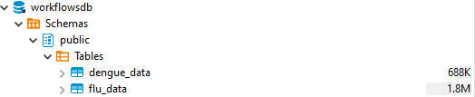

# SQL data analysis

In this report I add three different datasets to an sql database and join the table together.
With this data I make three different graphs to show my skill in R and SQL.
Working with databases like SQL is a common thing in data science. Databases like SQL make it easier to work with large sizes of data.

First thing is loading all the packages I use.

```{r, message=FALSE, warning=FALSE}
library(dslabs)
library(readr)
library(tidyverse)
library(here)
library(DBI)
library(DT)
```

Here I load the data with the use of the "read_csv" command and the "here package"
read_csv() can open an csv file and bind it to an object. As an option I used "skip = 10", this option will skip the first 10 rows while loading the data. This because the datafiles contain metadata that is not necessary for us. 

The datasets that I used are flu_data, dengue_data and gapminder.

* **flu_data** contains data on the weekly cases of the flu for countries around the world.

* **dengue_data** contains data about dengue cases around the world by week

* **gapminder** contains data about health and income for 184 countries from 1960 to 2016

to look at the imported data I used the "datatable()" function to see the first 6 rows of data from each dataset. It is also possible to scroll through the data because I set the option scrollx to true.


```{r, message=FALSE, warning=FALSE}
# Laden van flu data en de eerste 10 rows skippen
flu_data <- read_csv(here("data","flu_data.csv"), skip = 10)

# show the first 6 rows
datatable(flu_data, options = list(scrollx=TRUE, pageLength = 6))

# Laden van denque data en de eerste 10 rows skippen
dengue_data <- read_csv(here("data","dengue_data.csv"), skip = 10)

# show the first 6 rows
datatable(dengue_data, options = list(scrollx=TRUE, pageLength = 6))

# Laden van gampinder in gampinder (niet nuttig).
gapminder <- gapminder

# show the first 6 rows
datatable(gapminder, options = list(scrollx=TRUE, pageLength = 6))
```


Here a make the tables tidy, this for later use (is easier to work with tidy data).

I also renamed the column called Date to year in the gapminder dataset.

Using the "pivot_longer" function I made the dengue and flu data tidy. This means that I changed the data in a new format where there are three columns: Date, country and cases.
I also changed the country column into a factor using "as.factor"

```{r, message=FALSE, warning=FALSE}
# gapminder zelfde colnaam geven
gapminder_tidy <- gapminder %>% rename(Date = year)

# flu_data tidy maken
flu_data_tidy <- pivot_longer(data = flu_data, cols = -c("Date"), names_to = "country", values_to = "cases")

# en factor van country maken
flu_data_tidy$country <- as.factor(flu_data_tidy$country)

# dengue_data tidy maken
dengue_data_tidy <- pivot_longer(data = dengue_data, cols = -c("Date"), names_to = "country", values_to = "activity")

# en factor van country maken
dengue_data_tidy$country <- as.factor(dengue_data_tidy$country)
```

Where flu_data previously had `r nrow(flu_data)` rows the tidydata now has `r nrow(flu_data_tidy)` rows.

Where dengue_data previously had `r nrow(dengue_data)` rows the tidydata now has `r nrow(dengue_data_tidy)` rows.


After this I exported the tidy data to csv an rds files using the write_csv and write_rds fucntion. With the help of path = ... I specified where I wanted to save the data and how I wanted to call it.

```{r message=FALSE, warning=FALSE}
# Oplsaan als CSV bestand
write_csv(flu_data_tidy, path = here("data","flu_data_tidy.csv"))

# Oplsaan als CSV bestand
write_csv(dengue_data_tidy, path = here("data","dengue_data_tidy.csv"))

# Oplsaan als CSV bestand
write_csv(gapminder_tidy, path = here("data","gapminder_tidy.csv"))

# opslaan als rds bestand
write_rds(flu_data_tidy, path = here("data","flu_data_tidy.rds"))

# opslaan als rds bestand
write_rds(dengue_data_tidy, path = here("data","dengue_data_tidy.rds"))

# opslaan als rds bestand
write_rds(gapminder_tidy, path = here("data","gapminder_tidy.rds"))

```

I used these files to import them to a SQL database using the following commands.
These are the commands I used in the sql database with the program DBeaver.

First I had to create a table within the database usinging "CREATE TABLE", I named the table flu_data and added three colums: data, country and cases. I also made a primary key made up of the data and the country.

I did the same thing for dengue_data.

```{sql, eval = FALSE, message=FALSE, warning=FALSE}
# en table maken
CREATE TABLE flu_data (
  Date VARCHAR(50),
  country VARCHAR(50),
  cases VARCHAR(50),
  CONSTRAINT PK_flu PRIMARY KEY (Date,country)
);

# de date naar de table verplaatsen
COPY flu_data FROM 'C:/Users/Bas/Desktop/School/Programmeren/datascience/portfolio/data/flu_data_tidy.csv' WITH (FORMAT csv);

# de table laten zien
SELECT * FROM flu_data; 

# en table maken
CREATE TABLE dengue_data (
  Date VARCHAR(50),
  country VARCHAR(50),
  activity VARCHAR(50),
  CONSTRAINT PK_dengue PRIMARY KEY (Date,country)
);

# de date naar de table verplaatsen
COPY dengue_data FROM 'C:/Users/Bas/Desktop/School/Programmeren/datascience/portfolio/data/dengue_data_tidy.csv' WITH (FORMAT csv);

# de table laten zien
SELECT * FROM dengue_data; 
```

Within DBeaver the data base now looked like this: 

Here I connect to the SQL database and inspect the database with the help of R.
```{r, message=FALSE, warning=FALSE}
# connect to the database
con <- dbConnect(RPostgres::Postgres(), 
                 dbname = "workflowsdb", 
                 host="localhost", 
                 port="5432", 
                 user="postgres", 
                 password="kaas") 

# laat de tables zien
dbListTables(con)

# laat de colummen in flu_data zien
dbListFields(con, "flu_data")

# laat het tabel flu_data zien
head(dbGetQuery(con, 'SELECT * FROM flu_data'))

# disconnect van de database
dbDisconnect(con) 
```

These are the commands I used in the sql database with the program DBeaver to create the gapminder table.
```{sql, eval = FALSE, message=FALSE, warning=FALSE}
#create gapminder table
CREATE TABLE gapminder (
  country VARCHAR(50),
  Date VARCHAR(50),
  infant_mortality VARCHAR(50) not null,
  life_expectancy VARCHAR(50) not null,
  fertitlity VARCHAR(50) not null,
  population VARCHAR(50) not null,
  gdp VARCHAR(50) not null,
  continent VARCHAR(50),
  region VARCHAR(50),
  CONSTRAINT PK_gapminder PRIMARY KEY (Date,country)
);

#import the gampinder file
COPY gapminder FROM 'C:/Users/Bas/Desktop/School/Programmeren/datascience/portfolio/data/gapminder_tidy.csv' WITH (FORMAT csv);

# laat de tabel zien
SELECT * FROM gapminder; 
```

Here I select two table together forming 1 table wich I save as "gapminder_flu"
```{r, message=FALSE, warning=FALSE}
# connect to the database
con <- dbConnect(RPostgres::Postgres(), 
                 dbname = "workflowsdb", 
                 host="localhost", 
                 port="5432", 
                 user="postgres", 
                 password="kaas") 
gapminder_flu <- dbGetQuery(con, 'select distinct *
from flu_data,gapminder
where flu_data.country = gapminder.country;'
)
# disconnect van de database
dbDisconnect(con) 
```

Now I have the data wrangled an can make all kinds of graphs with the data
```{r, message=FALSE, warning=FALSE}
# filter for the Netherlands and calculate the average cases over time
cases_netherlands <- gapminder_flu %>% filter(country == "Netherlands") %>% group_by(date=as.Date(date)) %>% summarise(mean_cases=mean(as.numeric(cases)))

# make a gg line plot
netherlands_graph <- cases_netherlands %>%
  ggplot(aes(x = date, y = mean_cases)) +
  geom_line() +
  labs(
    title = "flu cases over time in the netherlands",
    y = "cases"
  )
netherlands_graph


```

```{r, message=FALSE, warning=FALSE}
# string naar date veranderen
gapminder_flu$date <- as.Date(gapminder_flu$date)

# nieuw object maken waar het gemmidelde cases is berekend in 2015 in europa
country_cases <- gapminder_flu %>% filter(between(date, as.Date("2015-01-01"), as.Date("2015-12-30"))) %>% filter(continent == "Europe") %>% group_by(country) %>% summarise(mean_cases=mean(as.numeric(cases)))

# ggplot maken
graph <-country_cases %>%
  ggplot(aes(x = country, y = mean_cases, fill = country_cases$country)) +
  geom_bar(stat = "identity") +
  theme(axis.text.x = element_text(angle = 90, vjust = 0.5, hjust=1))+
  labs(
    title = "Average flu cases per europian country in 2015"
  )

# ggplot in een plotly veranderen
graph
```

```{r, message=FALSE, warning=FALSE}
# string naar date veranderen
gapminder_flu$date <- as.Date(gapminder_flu$date)

# nieuw object maken waar het gemmidelde life_expectancy is berekend in 2015 in europa
country_life <- gapminder_flu %>% filter(between(date, as.Date("2015-01-01"), as.Date("2015-12-30"))) %>% filter(continent == "Europe") %>% group_by(country) %>% summarise(mean_cases=mean(as.numeric(life_expectancy)))

# ggplot maken
graph_life <-country_life %>%
  ggplot(aes(x = country, y = mean_cases, fill = country_cases$country)) +
  geom_bar(stat = "identity") +
  theme(axis.text.x = element_text(angle = 90, vjust = 0.5, hjust=1))+
  labs(
    title = "Average life expectancy per europian country in 2015"
  )

# ggplot in een plotly veranderen
graph_life
```

