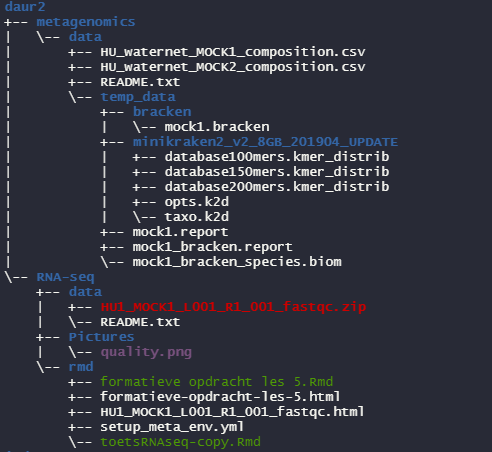

# Data managment

On thing that is very important in data science is managing your data, if your file system is the same as the file system of your colleagues it is easier to work together on a project. I grabbed one of my old project files and started ordering the file with the use of Guerrilla analytics. In a picture below you can see how my data is ordered. 

